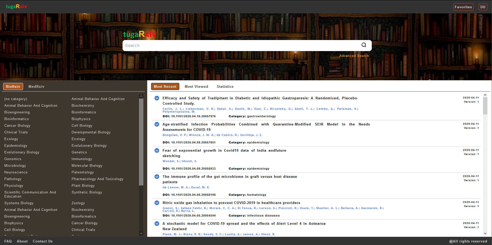
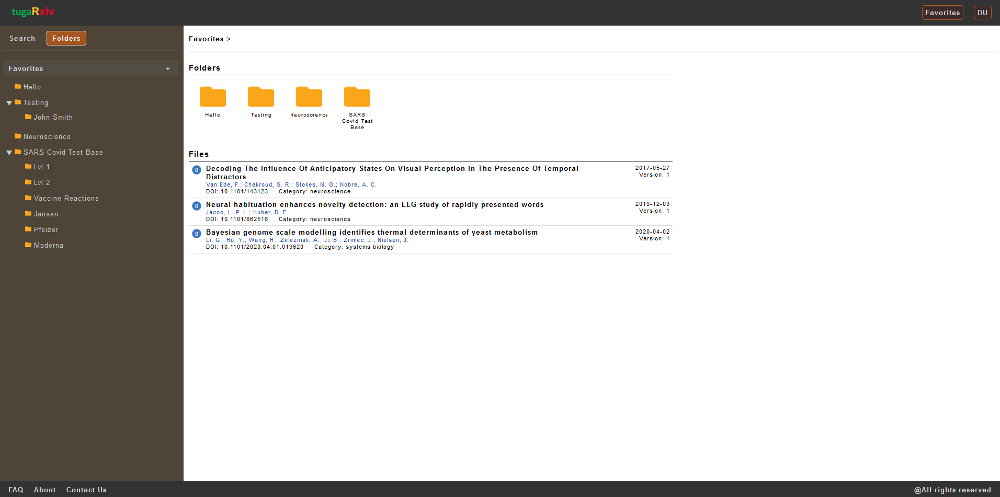

<hl>
<h3>Web app project aiming to increase functionality to bioRxiv and medRxiv pre-prints usage</h3>

As a final project for the Computer Science Management degree at the University
Autonomous Lisbon, we were asked to create a web application which we named tugaRxiv.

Biorxiv (https://www.biorxiv.org/) and medrxiv (https://www.medrxiv.org/) are
free repositories of scientific articles.
 

Biorxiv is linked to the life sciences area
while medrxiv has articles related to medicine.
 

However, both platforms
lack some tools that allow their users to manage
of your items more personalized, often even grouping them according to the projects in
who work, and it was in that sense that we proposed our project.

In this project a web application was created that has mirrored the content of the
Biorxiv and Medrxiv, but with new features.
 

The user could highlight the functionality of
show similar items, create a user account with which would have the possibility
to add personal notes to any article and to create folders on the bookmarks page in which
the desired items can be saved so as other features.

We also used an improved method of search by topics focused on the content in the pre-prints.

This project was developed by Luis Mergulhao, Sandra Lourenco e Ricardo Tomas
